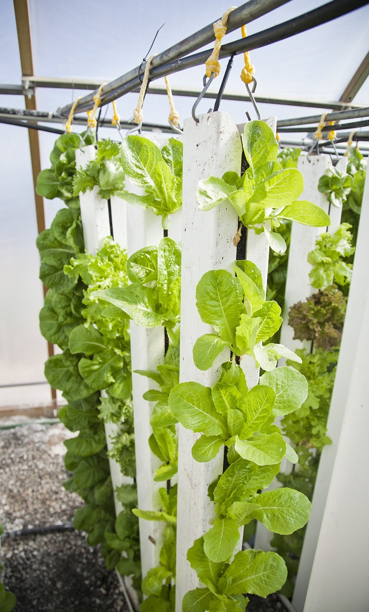

**Aeroponics** refers to a plant cultivation technique where roots are suspended in the air and nourished via a **fine mist**. This methodology removes the need for soil and often utilizes enclosed environments to create optimal growing conditions.

Through aeroponics, the root systems of plants are constantly or periodically misted with nutrient-dense water, thereby facilitating rapid growth and efficient nutrient uptake. In this lesson, students will delve into the advantages and disadvantages of aeroponics, and contemplate how FarmBot could be remodeled to support an aeroponic growth system.

# Pros and cons



|Pro                               |Description                                                         |
|----------------------------------|--------------------------------------------------------------------|
|**Water and Nutrient Efficiency** |Highly efficient use of water and nutrients with minimal waste.    |
|**Fast Growth**                   |Rapid plant development due to continuous access to nutrients.      |
|**Decreased Disease Risk**        |Lack of soil minimizes the spread of soil-borne diseases.           |
|**Spatial Efficiency**            |Allows vertical farming and effective use of limited space.         |
|**Tailored Nutrient Management**  |Precise control over nutrient and pH levels within the system.      |
|**Reduced Labor**                 |Automated systems can minimize the manual labor required.           |
|**Indoor Cultivation Capability** |Can be deployed indoors, ensuring year-round production.            |

|Con                               |Description                                                         |
|----------------------------------|--------------------------------------------------------------------|
|**Initial Cost**                  |Potentially high setup expenses, especially for large-scale systems.|
|**Complex Management**            |Requires vigilant monitoring and management of nutrient solutions.  |
|**Technical Challenges**          |Susceptibility to mechanical or technical issues and failures.      |
|**Energy Dependency**             |Reliant on constant power for pumps, misters, and potentially lights.|

# Integrating aeroponics with FarmBot



**Structure:** Typically, FarmBot is affixed to a solidly anchored bed. In an aeroponic setting, FarmBot might be mounted above a space where plants are suspended with their roots exposed to open air. This area would need to be adequately enclosed or shielded to prevent contamination and ensure consistent environmental conditions.

**Misting Mechanism:** FarmBot's default watering would need to be replaced with a system capable of delivering a nutrient-rich mist to the exposed roots of the plants. This would entail incorporating nozzles capable of producing a very fine mist, and a pump capable of maintaining the necessary pressure for mist generation.

**Environmental Control:** Control of humidity, temperature, and air circulation becomes paramount in an aeroponics setup. FarmBot may need additional peripherals such as fans or heaters, and additional sensors such as a humidity and temperature sensor to manage these aspects and ensure that the roots are receiving adequate moisture without becoming overly saturated.

**Sensors:** While soil sensors would be irrelevant in an aeroponic system, other types of sensors become crucial. Nutrient concentration, pH level, humidity, and air temperature sensors may need to be incorporated to ensure that the plants are receiving optimal care. Monitoring the root zone specifically can be crucial in preventing root drying and ensuring nutrient uptake is optimal.

**Maintenance Protocols:** Given the precision required in nutrient delivery and environmental control, FarmBot’s monitoring capabilities might be adapted to provide alerts for any parameters that fall outside optimal ranges, and may even be programmed to undertake automated corrective actions where possible.
