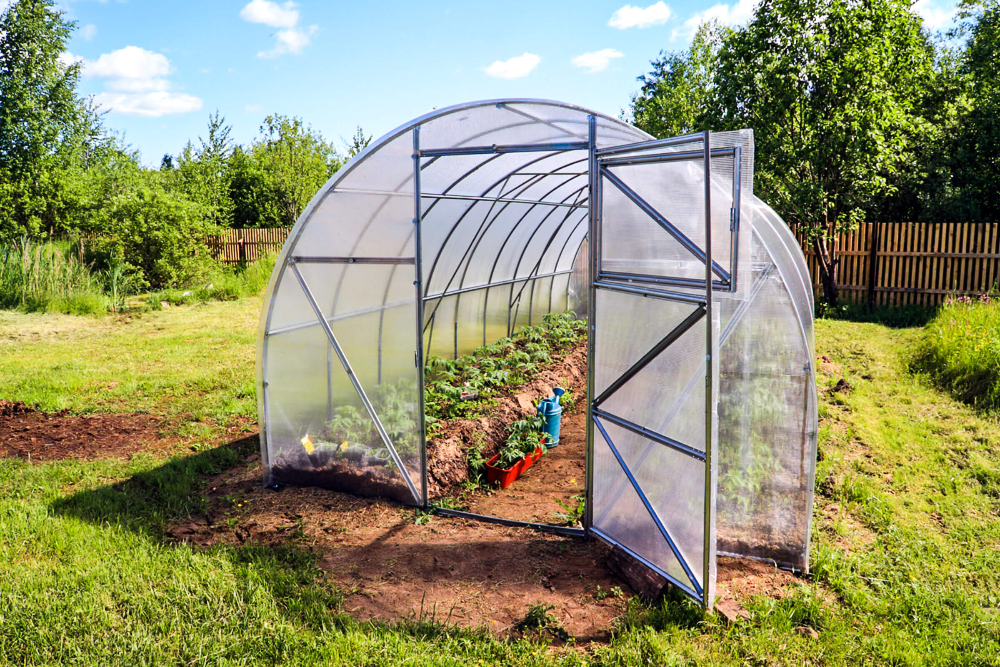
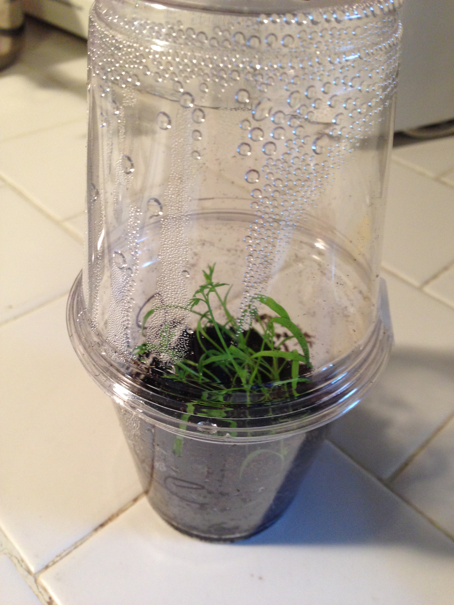



# Lesson overview

|**Grades**   |K-8
|**Time**     |35 minutes
|**Resources**|[Activity](#activity)
|**Standards**| What are the different growing requirements of different plants? What is habitat and how does it determine what plants can grow in it?  What plants thrive in a greenhouse and why? How does soil temperature affect plant growth?  How does soil temperature vary from location to location?  How can a greenhouse protect plants from extreme weather?  How can greenhouses reduce the impacts of weather to help grow food?  How does a greenhouse model the interactions between the Earth’s geosphere, biosphere, hydrosphere and atmosphere?  How can we collect data about our environment?  How does a greenhouse model the Earth’s water cycle, driven by sun and gravity?

# Materials

- 1 bag of potting mix
- One type of seed appropriate for the season
- 12oz clear plastic cups (3 per kid)
- Tape
- Water (could be in spray bottles)
- Tape for labeling
- Marker for labeling
- Laminated copy of the [greenhouse photo](#greenhouse-photo) if there is not a greenhouse on campus
- Laminated copy of the [mini greenhouse transpiration photo](#greenhouse-transpiration-photo)
- 1 [Mini Greenhouse Observation Sheet](https://docs.google.com/document/d/1NF5AVtt7xYAOvxvDKrufoZPsC2klsSqDztNMMznmAKc/edit?usp=sharing) per student (ask classroom teacher to print; there are 2
per page)

## Greenhouse photo

## Greenhouse transpiration photo

# Prep

- Review this how-to guide on making the mini greenhouses with kids for picture references: [How to Make a Greenhouse Using Plastic Cups](https://outsidetheboxhomeschoolers.wordpress.com/2014/07/04/stem-activity-mini-greenhouses/)
- Ask classroom teacher to print 1 [Mini Greenhouse Observation Sheet](https://docs.google.com/document/d/1NF5AVtt7xYAOvxvDKrufoZPsC2klsSqDztNMMznmAKc/edit?usp=sharing) per student (there are 2 per page)
- Decide ahead of time with classroom teacher where they will keep their experiment. This could be outside of their classroom or in a safe spot in the garden. Discuss that after the experiment design and set-up, it will be the classroom’s responsibility to water their cups. (Frequency of watering depends on weather. Determine this with teacher ahead of time).
- Pre-measure and mark the wooden skewers at 2, 4 and 6 inches.
- Pre-make your Soil Temperature Chart using butcher paper from the teachers lounge (view “Engage” to see full example of chart.)
- Set up an outside station for the engineering mini greenhouses portion of the activity. This could be set up many different ways, but keep efficiency in mind! An assembly line on either side of a long table works well, or if your garden has multiple picnic benches you can set up all of the supplies needed at each table.

# Activity

Students will make mini greenhouses to test the effect greenhouses have on plant growth. Follow this link for a visual guide on [How to Make a Greenhouse Using Plastic Cups](https://outsidetheboxhomeschoolers.wordpress.com/2014/07/04/stem-activity-mini-greenhouses/).

1. If applicable, visit a greenhouse in the garden. If a greenhouse is not present, bring a laminated [greenhouse photo](#greenhouse-photo) with you to provide a visual explanation. A Greenhouse is a house for plants. Why do humans live inside of houses (shelter, warmth, protection.) Have students step inside of the greenhouse to feel the temperature inside. Knowing what you know about soil temperature and growing conditions, do you have any evidence right now that a greenhouse structure could cause a difference in plant growth? How do you feel inside of this greenhouse? (Structure and Function; Cause and Effect; Engage in Argument from Evidence) (Warm! My evidence is the temperature I feel on my skin. It is warmer inside of the greenhouse than outside.) What season would it be advantageous to grow a plant inside of this greenhouse? (Winter! The greenhouse keeps the soil temperature within a range that seeds can sprout) How does this greenhouse system work? (Systems; Asking Questions and Defining Problems) Discuss the structure and functions of a greenhouse (Sun light enters the greenhouse through the glass panels / plastic fabric and is converted to heat energy inside. The air inside the greenhouse can’t escape and is hotter than air outside of the box.) How could we change the structure of the greenhouse to benefit plants in the summertime? (The summertime is hot! We could use a shade cloth material instead of clear plastic or glass to provide shade for our plants.) What other variables could we change to find out how the function of the greenhouse is affected? (We could leave the doors open, close the doors, build and utilize shelves, add a fan, etc.) (Structure and Function; Planning and Carrying out Investigations)

2. Today, we’ll be experimenting to see if a greenhouse has an effect on plant growth. You’ll each be engineering a mini greenhouse out of two plastic cups, tape, soil, seeds, and water. (Display the laminated photo example). If we want to see if these greenhouses help plants grow, what else do we need in our experiment? (A control to compare against.) Our control will be one plastic cup, soil, seeds, and water. What else should we keep the same between our control and our greenhouse? (soil height, seed type and number we plant.) Great! Lastly, what should we be observing to see if the mini greenhouses do cause a difference in growth? What about soil temperature? (Students should observe: soil temperature and plant height, and can also observe days till sprouting, color, amount of water needed, etc.) (Structure and Function; Developing and Using Models; Planning and Carrying out Investigations)

3. Invite students over to your mini greenhouse assembly station. Demonstrate fully how to assemble both the mini greenhouse and control cup. Make sure students label their greenhouses and controls!

4. Have students place their experiments in the designated spot you discussed with their teacher. Guide students to set up both their mini greenhouses and controls in a similar environment (not one cup in full sun and one cup in full shade).

5. Demonstrate how to properly water the experiment for consistency and success. Misting with a spray bottle is recommended until the soil is moist throughout. Because the cups will not have drainage holes avoid overwatering and discuss how to properly water with the students. Remind class that it is their responsibility to water their experiments!

6. Review: What are three things you can measure as evidence to see if the structure of your mini greenhouse causes a difference in plant growth? (Structure and Function; Cause and Effect; Engage in Argument from Evidence) Have their teacher provide them with the [Mini Greenhouse Observation Sheets](https://docs.google.com/document/d/1NF5AVtt7xYAOvxvDKrufoZPsC2klsSqDztNMMznmAKc/edit?usp=sharing) and ask students make weekly observations for one month.

# Evaluation

Show students the laminated copy of the [greenhouse transpiration photo](#greenhouse-transpiration-photo). What do you notice? Why do humans sweat? Why do plants sweat?

Describe transpiration and draw on your graphic organizer as needed to help explain: Plants recycle water back into the atmosphere through a process called transpiration. Transpiration is a plant’s way of sweating, releasing excess water into the air through its leaves. Water enters through the roots, carrying air and nutrients, and is pulled through the plant continuously in columns, like a straw! The excess water is released into the atmosphere through tiny openings in the leaves called stomata. You can think of these as the pores on your skin. This water is evaporated from the leaves by the heat of the sun, pulling more water up through the plant to take its place. The constant flow of water through the plant gives it shape and life! In summary, plants recycle a lot of water into the atmosphere when the sun evaporates water from the leaves, which in turn creates a vacuum in the leaves that pulls water up from the roots.

Ask students to raise their hands to share: Where is the water in this picture? (It has condensed onto the walls of the “greenhouse”.) How is this sweat important to the plant? (It pulls more water through the plant.) Where does this water go in the greenhouse? Does it escape? (No, it cycles back into the soil for the roots to suck up.) Do plants in a greenhouse require more or less water? (Using greenhouses reduces our impact on the local environment through conserving water.) (Systems; Asking Questions and Defining Problems)

# What's next?

* [Extension Activities](../greenhouses/extension.md)
