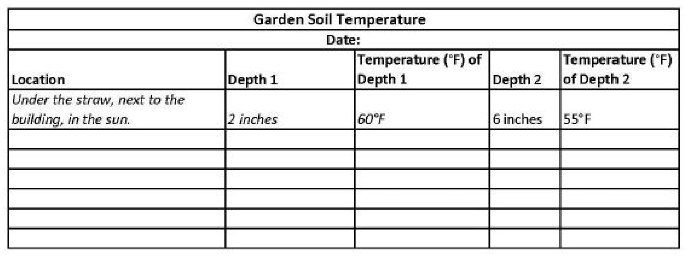

* toc
{:toc}



# Lesson overview

|**Grades**   |2-8
|**Time**     |40 minutes
|**Resources**|[Discussion](#discussion), [Activity](#activity)
|**Standards**| What do plants and animals need to survive?  How do humans change their environment to meet their needs?  How can we grow plants in cold climates?  How do humans change their environment to meet their needs?

# Materials

- Pre-made [soil temperature chart](#soil-temperature-chart)
- Four-five soil thermometers
- Four-five thin wooden skewers market at 2, 4, and 6 inches
- Clipboards
- Plain white paper or 3x5 note cards (1 per group of 3-4 students)
- Pencils

# Discussion

Begin with a classroom discussion in the seating area in your garden. Write the following questions on the board, record answers, and discuss with the class:

_What is weather?_ Write some of their defining words on the board. One easy explanation of the difference between weather and climate is that weather is what you are wearing today (shorts, sun hat, gloves, etc.) and climate is what you have in your closet (you might have summer clothes all year round in California, or some summer and some winter clothes in a more seasonal climate).

_What months are hot, cold, warm, cool, snowy, or rainy?_ Write the seasons on the board and record the students’ answers next to the season’s name. What are average temperatures in the winter, summer, fall, spring? Include example temperatures next to descriptive words for the seasons like hot, cold, warm, cool.

_What seasons are best for growing plants?_ What does it feel like outside during those months? Explain to students that soil temperatures changein the seasons, just like air temperatures change. So when the air feels cold, the soil is cooling too. Tell students that before gardenersplant, they often measure the temperature of their soils. Why does soil temperature matter to a gardener? What effects does soil temperature have? Soil temperature has a significant role in helping to determine the rate of plant growth, and whether a plant will even survive. (Cause and Effect; Construct Explanations and Design Solutions)

# Soil temperature chart

Display the soil temperature chart on the board and explain it to students.

|Soil temperature|Conditions during growing season|
|----------------|--------------------------------|
|Less than 40F   |No growth                       |
|40F to 65F      |Some growth                     |
|65F to 70F      |Fastest growth                  |
|70F to 85F      |Some growth                     |
|Above 85F       |No growth                       |

We are now going to measure the soil temperature in our own garden to determine if the conditions are right for seed germination.

# Activity

1. Divide the class into groups of three to four students. Tell them that they are going to record the temperature of the soil in different areas of the garden.

2. To keep track of the data collected, you need the students to record their measurements in a chart. Give each group a clipboard with a pencil and a piece of paper (or 3x5 note card). Guide students in creating the chart below (or a similar chart) on their pieces of paper. Explain that they will measure the soil temperature at different depths. Do they think the soil temperature will be warmer or cooler as they measure the temperature deeper into the ground?

3. Take students to the garden and demonstrate how to measure soil temperature. First measure the air temperature. Using a thermometer, measure the air temperature at shoulder height. Measure the temperature at the surface of the ground. Is there any difference? To determine the soil temperature, use the skewer that you have marked at 2, 4 and 6 inches. Push the skewer into the ground until you reach the 2 inch mark. Remove the skewer and insert the thermometer for one minute, then remove the thermometer and quickly record the temperature. Demonstrate how to record the data on the chart. Repeat at 4 or 6 inches.

4. Ask each group of students to measure and record the soil temperature in at least three locations, at two depths (2, 4 or 6 inches) per location. Help the groups identify three distinct locations for their measurements (an example of three measurement areas might include a raised bed, in a grassy area, and under mulch).

After the students measure the temperature in three locations, gather them together and ask each group to report their findings.

Ask students to refer to the [soil temperature chart](#soil-temperature-chart) to determine if the soil temperatures are good for planting. As the students most likely discovered, the soil temperatures change with soil depth. Ask students to raise their hands to share: Ask students to compare the temperatures they recorded at different depths. At which depth is the soil the warmest? Which is the coolest? Guide students in subtracting the coolest temperature from the warmest temperature to determine the difference (in degrees).

_How does the sun affect soil temperature?_ Did any groups measure soil temperatures in an area that gets full sun and an area that is in full shade? What does your data tell us? How can we maximize the energy from the sun during a colder season?

# What's next?

* [Engineering Mini Greenhouses](../greenhouses/engineering-mini-greenhouses.md)
