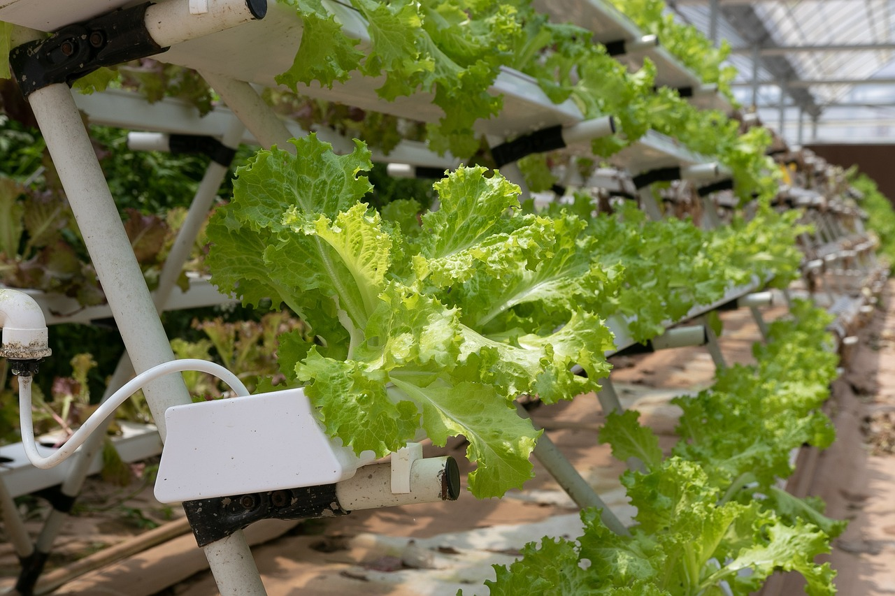

**Hydroponics** is a method of cultivating plants without the use of soil. Instead, plants are grown in an **aqueous solution** that provides the necessary nutrients directly to their roots.



Hydroponics allows for efficient use of water and nutrients, often resulting in faster plant growth and potentially higher yields compared to soil-based cultivation. However, it is not without its disadvantages. In this lesson, students will learn about the pros and cons of hydroponics and brainstorm how FarmBot might be modified to grow plants with this method.

# Pros and cons



|Pro                        |Description                                                         |
|---------------------------|--------------------------------------------------------------------|
|**Water Efficiency**       |Uses up to 90% less water than traditional farming.                 |
|**Space Saving**           |Can be practiced in smaller spaces, including urban environments.   |
|**Growth Speed**           |Plants often grow faster due to optimized nutrient delivery.        |
|**Fewer Pests & Diseases** |Reduced risk of soil-borne diseases and pests.                      |
|**Controlled Environment** |Allows precise control over nutrient levels, pH, and other factors. |
|**Year-Round Cultivation** |Can be practiced indoors or in greenhouses.                         |
|**Higher Yields**          |Plants often produce more fruit and vegetables.                     |

|Con                               |Description                                                         |
|----------------------------------|--------------------------------------------------------------------|
|**Startup Costs**                 |Initial setup can be more expensive than soil-based cultivation.
|**Requires Monitoring**           |Systems must be regularly checked for pH, nutrient levels, and other parameters.
|**Energy Dependence**             |Often relies on electric pumps, lights, and other equipment, leaving the system susceptible to power outages.
|**Potential for System Failures** |Technical malfunctions could result in system imblanaces that harm plants.

# FarmBot and hydroponics



**Mechanics:** FarmBot is normally mounted to a wooden raised bed. However, hydropnic systems are often built on top of a reservoir or tank. FarmBot could be mounted to a platform above the reservoir, or the reservoir could be raised to the height of a traditional raised bed.

**Watering:** FarmBot normally waters plants from above, but hydroponic systems often use a recirculating system that delivers nutrient-rich solutions to the roots. FarmBot's watering system (the solenoid valve and tubing) could be replaced with a pump to deliver and circulate nutrient-rich solutions to the plants. Alternatively, the solenoid valve could be used to control the flow of nutrient-rich solutions from storage bottles to the water tank.

**Camera Monitoring:** FarmBot's existing camera would likely be very useful for hydropnics growing, allowing for early detection of plant health issues that may be caused by nutrient imbalances.

**Sensors:** FarmBot's existing soil moisture sensor will likely not be useful in a hydropnics setup since there is no soil. However, other sensors may be necessary to monitor the nutrient solution, temperature, pH, dissolved oxygen, and other parameters.
