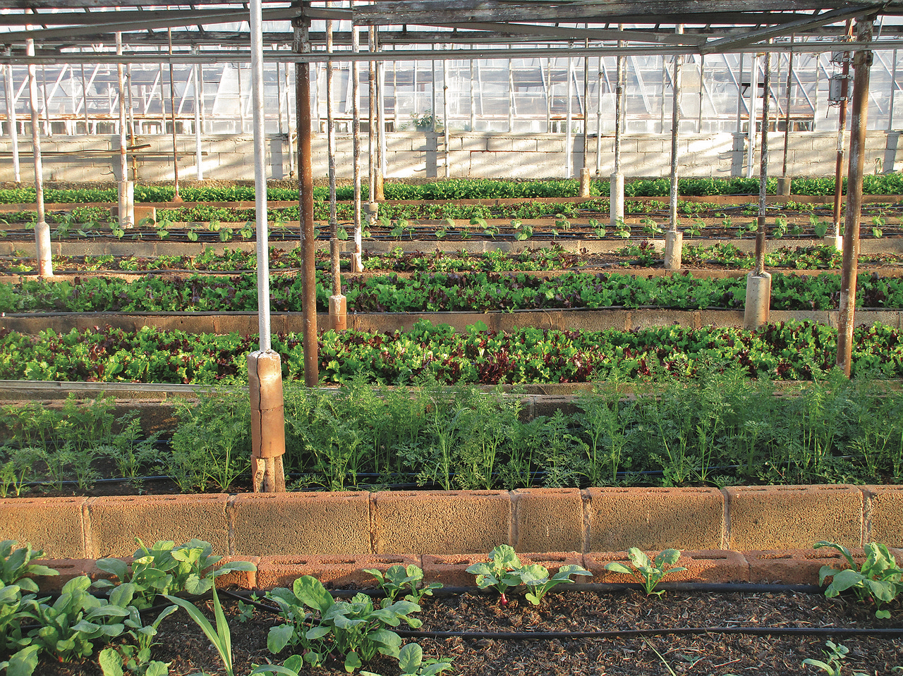
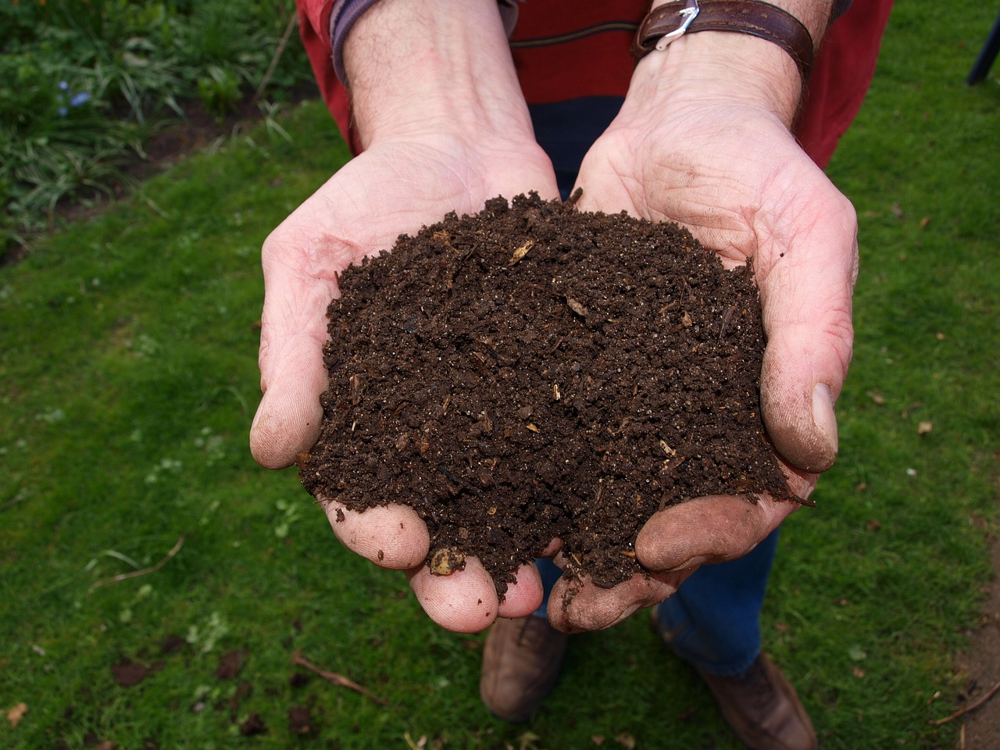

**Soil-based growing** primarily revolves around using the earth's natural medium - **soil**, to cultivate plants. Unlike hydroponics or aeroponics, soil-based growing relies on nutrient-dense soil to supply plants with the essential elements they need to flourish.



Soil-based cultivation is a timeless method, celebrated for its simplicity, affordability, and accessibility. However, there are also challenges and limitations to this traditional method. Students will explore the advantages and disadvantages of soil-based growing and brainstorm how FarmBot can be extended beyond plant cultivation in a raised bed to manage a broader homestead food system.

# Pros and cons





|Pro                          |Description                                                          |
|-----------------------------|---------------------------------------------------------------------|
|**Natural Ecosystem**       |Supports a vibrant soil ecosystem which benefits plant health.       |
|**Low-tech**                |Generally requires less specialized equipment than other methods.    |
|**Low Start-Up Costs**      |Often cheaper to establish compared to hydroponics or aeroponics.    |
|**Broad Crop Variety**      |Accommodates a wide range of crops without specialized setups.       |
|**Sustainability**          |Allows for the use of natural pest control and organic fertilizers.  |
|**Traditional Knowledge**   |Generations of established knowledge and techniques are available.   |

|Con                          |Description                                                          |
|-----------------------------|---------------------------------------------------------------------|
|**Water Usage**              |Can be less efficient in water use compared to hydroponics.          |
|**Weed Management**          |Manual weeding or herbicides are often necessary.                    |
|**Seasonal Limitations**     |Outdoor cultivation is often subject to seasonal constraints.        |
|**Pest Vulnerability**       |Can be more susceptible to pests and soil-borne diseases.            |
|**Labor Intensity**          |May require more physical labor for tasks like tilling and weeding.  |
|**Nutrient Management**      |Requires careful monitoring and management of soil nutrient levels.  |

# Expanding FarmBot's capabilities to the homestead



**Managing a Chicken Coop:**
- **Feeding:** FarmBot might be adapted to automate feeding, distributing feed at scheduled intervals.
- **Watering:** Automating water provision in a coop to ensure a consistent supply.
- **Egg Collection:** Designing a mechanism for gentle egg collection and conveyance.
- **Security:** Implementing a system to secure the coop at night and ensure the safety of the chickens.

**Watering an Orchard:**
- **Automated Watering:** Utilizing FarmBot’s watering capabilities to manage irrigation in an orchard setting.
- **Tree Health Monitoring:** Implementing sensors to monitor tree health, such as leaf color, fruit production, and trunk girth.
- **Pest Control:** Exploring automated solutions for detecting and mitigating pest issues in the orchard.

**Monitoring and Watering a Compost Pile:**
- **Moisture Level Monitoring:** Using sensors to measure moisture levels within the compost pile and activating watering mechanisms as needed.
- **Temperature Tracking:** Employing temperature sensors to monitor compost health and activity.
- **Turnover Reminders:** Implementing a notification system to remind users when to turn over the compost pile.
- **Composition Analysis:** Considering ways in which FarmBot could sample and analyze the nutrient composition of the compost.

**Additional Considerations:**
- **Integration with Renewable Energy:** Consider incorporating solar or wind energy to power FarmBot’s additional functionalities.
- **Enhanced AI Capabilities:** Employ machine learning to analyze data and predict trends or needs within various aspects of homestead management.
- **User Interface:** Develop an intuitive and user-friendly interface that allows for easy management and monitoring of various subsystems.

---

Note that expanding FarmBot's capabilities to handle these diverse tasks would require significant alterations in its mechanical design, sensor suite, and software capabilities. The brainstorming section can serve as a starting point for innovative projects, and prototyping these ideas could be an inspiring challenge for students interested in agriculture, robotics, and sustainability.