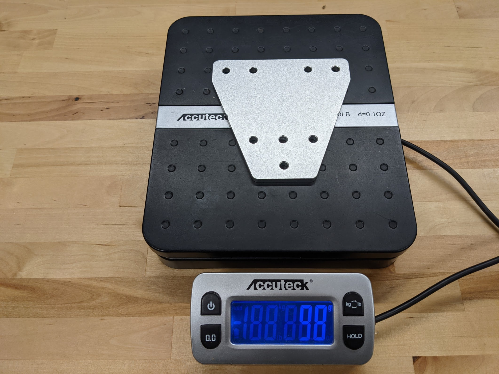

# Lesson overview

|**Grades**   |3-6
|**Time**     |1 hour
|**Resources**|[Lecture](#lecture), [Video](#video), [Experiment](#experiment)
|**Standards**|<br><br>

# Lecture

When designing new parts for the FarmBot, mass can be an important consideration.

- How will the added mass affect shipping costs?
- Will the motors be strong enough to smoothly accelerate the mass of the gantry, cross-slide, and/or z-axis?
- Will the universal tool mount's magnets (FarmBot Genesis kits) be strong enough to hold up the mass of the tool against the will of gravity?

When mass is an important design consideration, it can be helpful to calculate the mass of a new part design before building a prototype. To calculate the **mass**, we can multiply the part's **volume** with the material's **density**.

```
Mass = Volume x Density
```

We can find out the volume of our new part design from our CAD tool. In Onshape (the CAD tool used to design FarmBot parts), you can simply click the part and see the volume in the lower right corner of the screen. But if the CAD tool doesn't know the **dnesity** of the material we plan to make our part out of, it won't have enough information to calculate **mass**.

While it is easy enough these days to look up a material's density online or in a textbook, we can also find out the desnity of a material with a simple experiment!

In this lesson students will experimentally determine the density of the aluminum used to make FarmBot's plates and brackets. Once the density of aluminum is determined, we can use it in our equation, along with the volume of a new part design, to figure out the mass of the part before we build it!

If the mass is acceptable, then we can go ahead building a prototype, but if its too much it's back to the drawing board!

# Video



# Experiment

**Step 1:** Measure and record the **mass** (in grams) of a track joining plate by placing it on a scale. If a scale is unavailable, record 98 grams as the mass.



**Step 2:** Fill a large graduated beaker with 500mL of water. Submerge the track joining plate fully in the water. The water level should rise because the track joining plate **displaces** the water in the amount of the plate's **volume**. Record the new level of the water.

**Step 3:** Calculate the plate's **volume** in mL by subtracting the old water level (500mL) from the new water level.

```
Plate Volume (mL) = New Water Level (mL) - Old Water Level (mL)
Plate Volume (mL) = New Water Level (mL) - 500 (mL)
```

Because mL are commonly used with liquids and cm<sup>3</sup> are commonly used with solids, convert the volume of the plate from mL to cm<sup>3</sup>. 1 mL = 1 cm<sup>3</sup>, so the conversion is easy!

```
Plate Volume (mL) = Plate Volume (cubic centimeters)
```

**Step 4:** Calculate the density of the plate in grams/cm<sup>3</sup>.

```
Density (grams/cubic centimeters) = Mass (grams) / Volume (cubic centimeters)
```

The true density of aluminum is 2.7 grams/cm<sup>3</sup>. How close was your estimation?

**Step 5:** Now let's say you have designed a new FarmBot part that you plan to make out of aluminum. Another engineer on your team says that you have a mass budget of 2 kg (2,000 grams) for your new part. Your CAD tool says the new part has a volume of 892 cm<sup>3</sup>. Calculate the mass of the new part design to determine if it meets the mass requirement!

```
Mass (grams) = Volume (cubic centimeters) x Density (grams/cubic centimeters)
```
