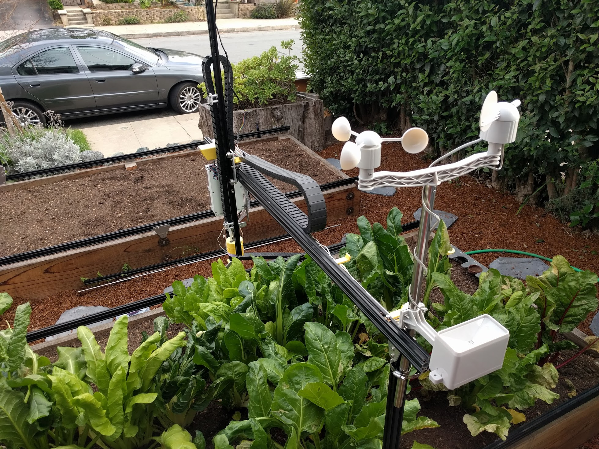

FarmBot is designed to be a platform conducive to **modification** and **extension**, which can provide students with cross-disciplinary learning experiences covering hardware design, manufacturing, programming, electronics, and more.

In the following documentation pages, we share just a handful of ideas for student projects including adding new sensors and peripherals to FarmBot, or developing completely new tools compatible with the FarmBot Genesis UTM.

<i>This FarmBot has been augmented with a weather station</i>

# Example projects

Below are some example projects from university teams that have developed their own FarmBot tools.

## Weed trimmer tool

A senior design team at the Liberty University School of Engineering partnered with FarmBot Inc to design and prototype a weed trimming tool.





## Gripper tool

An interdisciplinary team of students at Curio, a vocational school in the Netherlands, have developed a prototype FarmBot gripper tool for harvesting crops.



## Seeder pod tool

A senior design team at the Liberty University School of Engineering partnered with FarmBot Inc to design and prototype a seeder pod tool.



# What's next?

 * [Maximizing Output](https://genesis.farm.bot/docs/maximizing-output)
 * [Capture and Use Rainwater](https://genesis.farm.bot/docs/capture-and-use-rainwater)
 * [Turn FarmBot into a Weather Station](https://genesis.farm.bot/docs/turn-farmbot-into-a-weather-station)
 * [Monitor Resource Usage](https://genesis.farm.bot/docs/monitor-resource-usage)
 * [Power FarmBot with Solar](https://genesis.farm.bot/docs/power-farmbot-with-solar)
 * [Use FarmBot as a 3D CNC Camera Rig](https://genesis.farm.bot/docs/use-farmbot-as-a-3d-cnc-camera-rig)
 * [Complete the Cycle with Compost](https://genesis.farm.bot/docs/complete-the-cycle-with-compost)
 * [Monitor FarmBot with a Webcam](https://genesis.farm.bot/docs/monitor-farmbot-with-a-webcam)
 * [Bees, Worms, Chickens, and More!](https://genesis.farm.bot/docs/bees-worms-chickens-and-more)
 * [3D Imaging with an OAK Camera](https://genesis.farm.bot/docs/3d-imaging-with-an-oak-camera)
 * [Take Time Lapse Plant Photography](https://genesis.farm.bot/docs/take-time-lapse-plant-photography)
 * [Put FarmBot in a Greenhouse](https://genesis.farm.bot/docs/put-farmbot-in-a-greenhouse)
 * [Control Servos](https://genesis.farm.bot/docs/control-servos)
 * [Control Relays](https://genesis.farm.bot/docs/control-relays)
 * [Tool Spec](https://genesis.farm.bot/docs/tool-spec)
