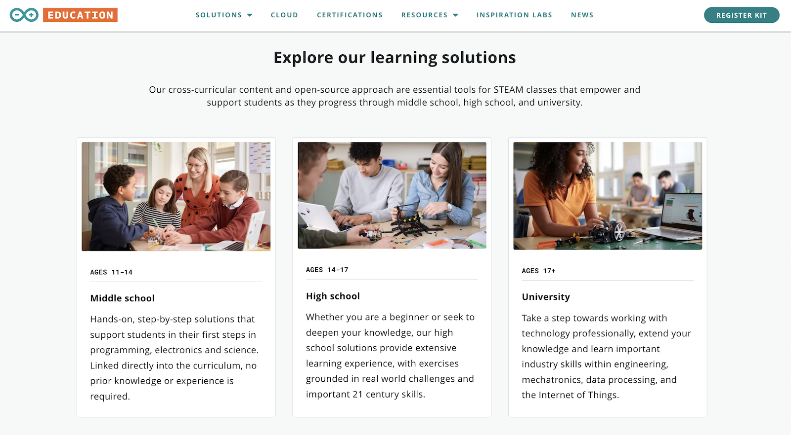

**[Arduino Education](https://www.arduino.cc/education/)** has created the next generation of **STEAM programs** that empower students on their learning journey of electronics, coding, robotics, and more through middle school, high school, and university.



Arduino's cross-curricular content and **open-source approach** are essential tools for STEAM classes that empower and support students in:

:apple: **Middle school** - Hands-on, step-by-step solutions that support students in their first steps in programming, electronics and science. No prior knowledge or experience is required.

:school: **High school** - Solutions that provide extensive learning experience, with exercises grounded in real world challenges and important 21st century skills.

:mortar_board: **University** - Take students a step towards working with technology professionally, extend their knowledge, and learn important industry skills within engineering, mechatronics, data processing, and the internet of things.

# What's next?

* [View the Curriculum](https://www.arduino.cc/education/)
* [Jump to Middle School (ages 11-14)](https://www.arduino.cc/education/middle-school/)
* [Jump to High School (ages 14-17)](https://www.arduino.cc/education/high-school/)
* [Jump to University (ages 17+)](https://www.arduino.cc/education/university/)
