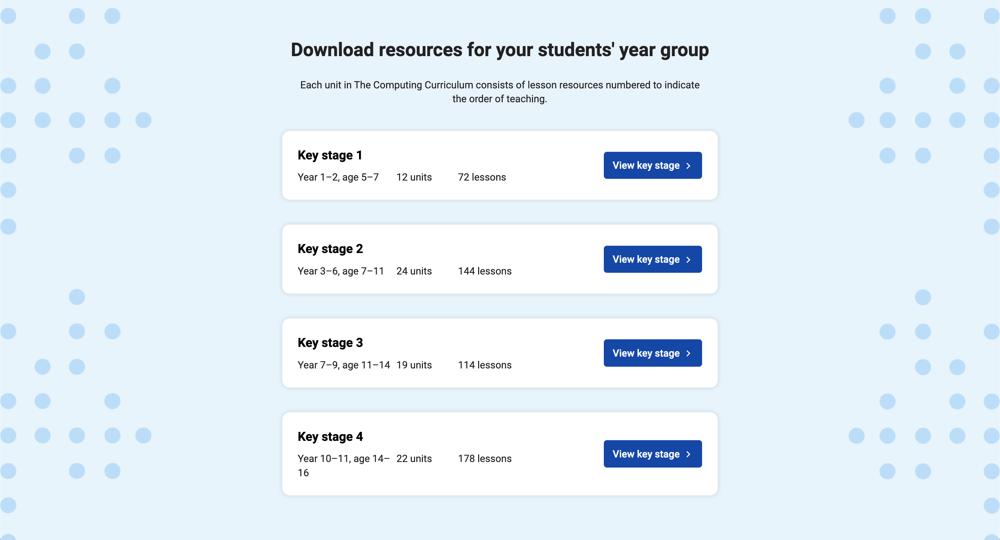

**[The Computing Curriculum](https://www.raspberrypi.org/curriculum)** is a complete set of resources developed by the **Raspberry Pi Foundation** to help you teach computing to students aged 5 to 16.



The computing curriculum is:

:writing_hand: **Written by specialist educators**, including lesson plans, slides, activity sheets, homework and assessments.

:information_desk_person: **Updated regularly** based on the latest research and teachers' feedback.

:classical_building: **Structured** as units for each year group, and built on a clear progression framework.

:peace_symbol: **Free** for you to download and adapt to your students' needs.

# What's next?

* [View the Curriculum](https://www.raspberrypi.org/curriculum)
* [Jump to Key Stage 1 (ages 5-7)](https://www.raspberrypi.org/curriculum/key-stage-1)
* [Jump to Key Stage 2 (ages 7-11)](https://www.raspberrypi.org/curriculum/key-stage-2)
* [Jump to Key Stage 3 (ages 11-14)](https://www.raspberrypi.org/curriculum/key-stage-3)
* [Jump to Key Stage 4 (ages 14-16)](https://www.raspberrypi.org/curriculum/key-stage-4)
