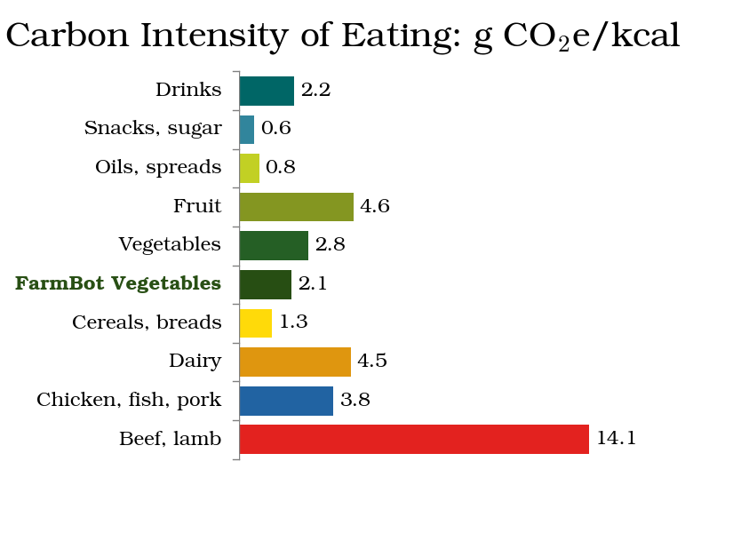

Now that students have calculated the carboon footprint of FarmBot, it's time to compare it with the carbon footprint of store-bought vegetables. This lesson will help students understand the environmental impact of different food production and sourcing methods, and how they can make informed decisions to adopt more sustainable practices.

|**Grades**   |4-10
|**Time**     |1.5 hours
|**Standards**|    

# Store-bought vegetables

Have students use published data to determine the carbon intensity of average vegetables grown in the US.

**Recommended resources:**

- [Our World In Data - Environmental Impacts of Food Production
](https://ourworldindata.org/environmental-impacts-of-food)
- [shrinkthatfootprint.com - The Carbon Foodprint of 5 Diets Compared](https://shrinkthatfootprint.com/food-carbon-footprint-diet)

# FarmBot-grown vegetables

Have students use the data they collected about the [emissions from use](emissions-from-use.md) of FarmBot, combined with the expected [yield of vegetables](https://yield.farm.bot/) to determine the carbon intensity of FarmBot-grown vegetables.

# Comparison

Have students compare the carbon intensities of FarmBot-grown and store-bought vegetables. Ask them to calculate and discuss the implications of these figures in terms of environmental impact over a year of eating, or a lifetime of eating.



# Beyond the basic calculations

Explain that these calculations are not taking into account the CO2 emitted for the production of FarmBot itself nor the production of industrial tractors, transportation trucks, highways, and grocery store buildings either.

Considering the difference in materials used in the US food supply chain vs the materials used in a FarmBot, what conclusions could be drawn when taking all that into account?
