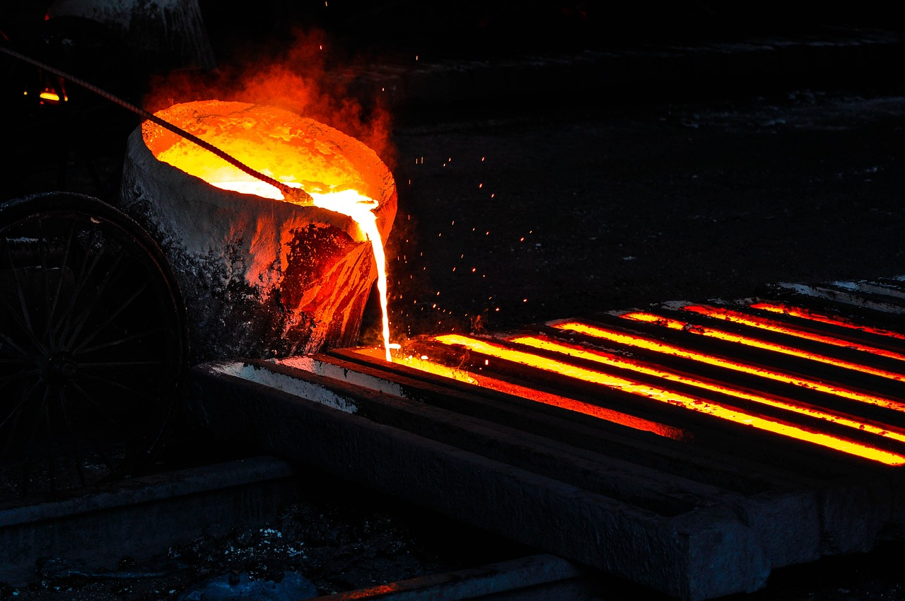
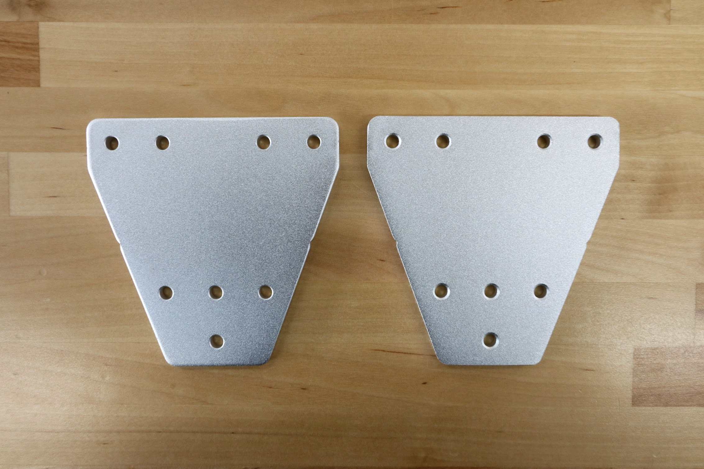
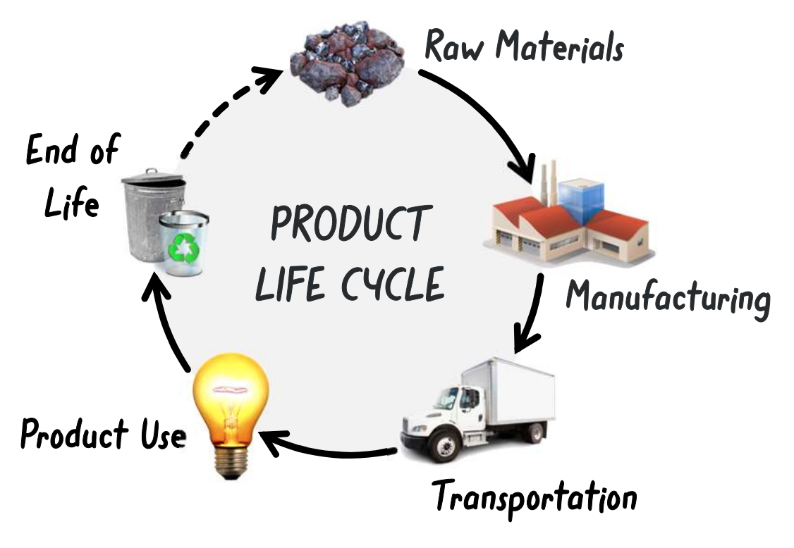
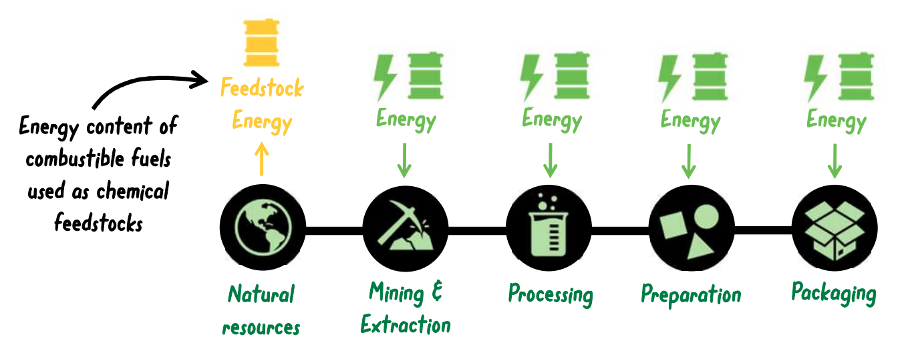

**Embodied energy** is the total energy used in the production of a product, from raw material extraction to manufacturing to shipping the final good to the customer. Understanding and calculating a product's embodied energy is pivotal when assessing a product's environmental impact.



# Lesson overview

|**Grades**   |3-8
|**Time**     |1 hour
|**Standards**|   

In this lesson students will estimate FarmBot's embodied energy and the associated **embodied emissions** using industry averages, estimations, and simple calculations. They will then reflect on the accuracy and implications of their estimations.

# What is embodied energy?



Which of the following processes contribute to the embodied energy of a product?



The graphic below illustrates in more detail the various stages of a product's production and the associated embodied energy:

# What are embodied emissions?

**Embodied emissions** are the total emissions associated with the use of the **embodied energy**. Embodied emissions are typically measured in terms of carbon dioxide (CO2) emissions. While some industrial processes may create other greenhouse gases such as methane (CH4) or nitrous oxide (N2O), these can be converted to CO2 equivalents.

The table below shows the embodied energy of various materials in FarmBot, highlighting the significant differences between them:

| Material          | kg of CO2/kg of material |
|-------------------|--------------------------|
| Aluminum          | 8.24                     |
| Copper            | 2.60                     |
| Plastic           | 2.53                     |
| Rubber            | 3.18                     |
| Stainless Steel   | 6.15                     |



# Calculating embodied energy

With the information above, have students estimate the embodied emissions of FarmBot by:

- Estimating the weight of each material used in FarmBot using a total weight of the FarmBot kit of 15kg.
- Multiplying the weight of each material by the kg of CO2/kg of material.
- Summing the total CO2 emissions.

| Material          | Weight (kg) | kg of CO2/kg of material | kg of CO2   |
|-------------------|-------------|--------------------------|-------------|
| Aluminum          |             | 8.24                     |             |
| Stainless Steel   |             | 6.15                     |             |
| Plastic           |             | 2.53                     |             |
| Rubber            |             | 3.18                     |             |
| Copper            |             | 2.60                     |             |
| **TOTAL**         | **15kg**    |                          |             |

The table below illustrates an example estimation:

| Material          | Weight (kg) | kg of CO2/kg of material | kg of CO2   |
|-------------------|-------------|--------------------------|-------------|
| Aluminum          | 9.5         | 8.24                     | 78.3        |
| Stainless Steel   | 1.4         | 6.15                     | 8.6         |
| Plastic           | 2.8         | 2.53                     | 7.1         |
| Rubber            | 1.0         | 3.18                     | 3.18        |
| Copper            | 0.3         | 2.60                     | 0.8         |
| **TOTAL**         | **15kg**    |                          | **97.98kg** |

# Discussion topics

- How might the embodied energy of FarmBot change if it were manufactured in a different country?
- Our calculations are based on industry averages. The actual emissions might be different due to various factors in the specific manufacturing processes used. What are some of these factors?
- What are some ways to reduce the embodied energy of FarmBot?
- Why might it be essential to assess the embodied energy of a product in sustainability considerations?
- How might embodied energy of the same product change over time?
